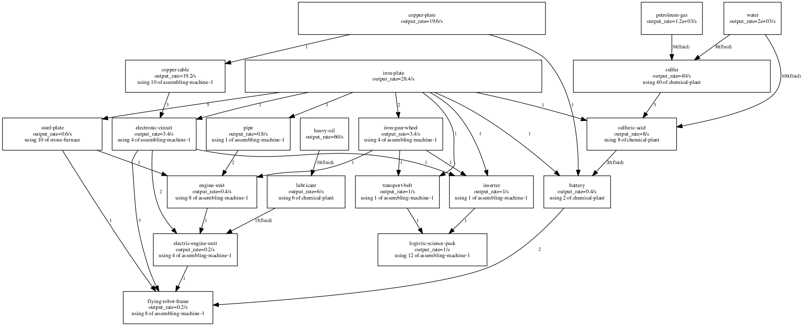

# graphit.pl6

Computes a directed graph of a Factorio production chain.
Reads from a text file containing output constraints that you provide, and from your Factorio base directory.
Since it reads from the base .lua files themselves, it only supports vanilla items/recipes and not mods.

written by Hermitude (Hermit#2408 on Discord).

## Dependencies

* GraphViz (creating .dot then outputing .svg)
* ImageMagick (converting ssvg -> .png)

## Syntax

`graphit.pl6 [-d <basedir>] <filename>`

The filename should end in `.fsch`. This name pattern is used

E.g. for `<filename> = complicated.fsch`
```
schema {
  produce     0.2/s flying-robot-frame using assembling-machine-1
  produce     1/s advanced-circuit using assembling-machine-1
  produce     iron-plate using electric-furnace
  produce     copper-plate using electric-furnace
  exclude     "ore"
}
```
gives:


